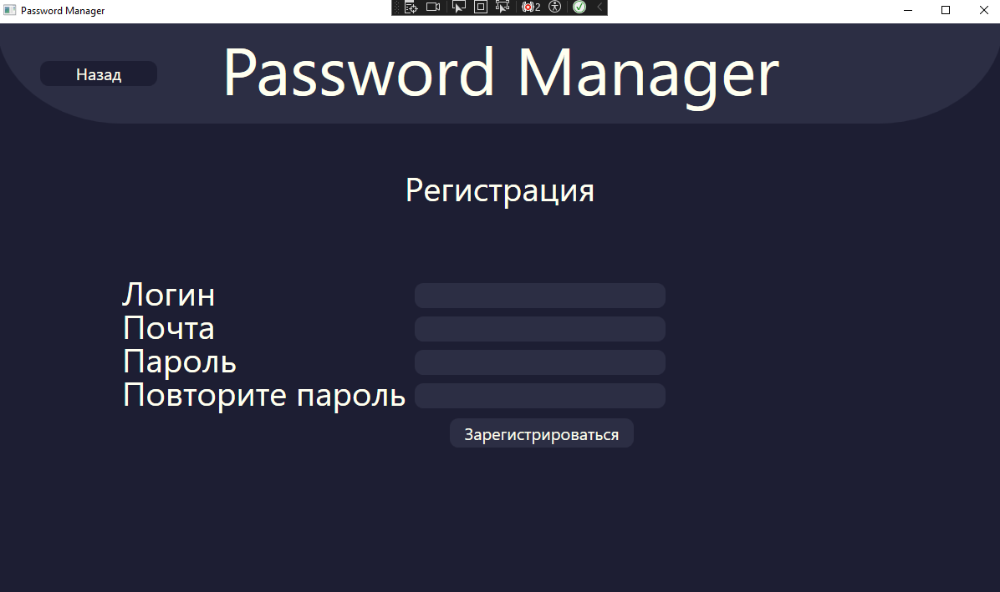
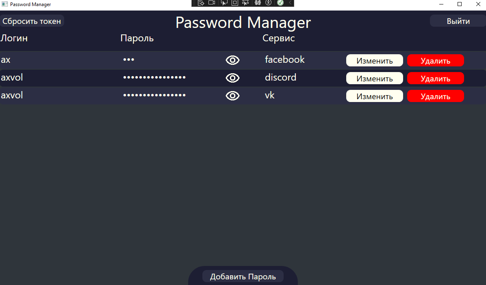
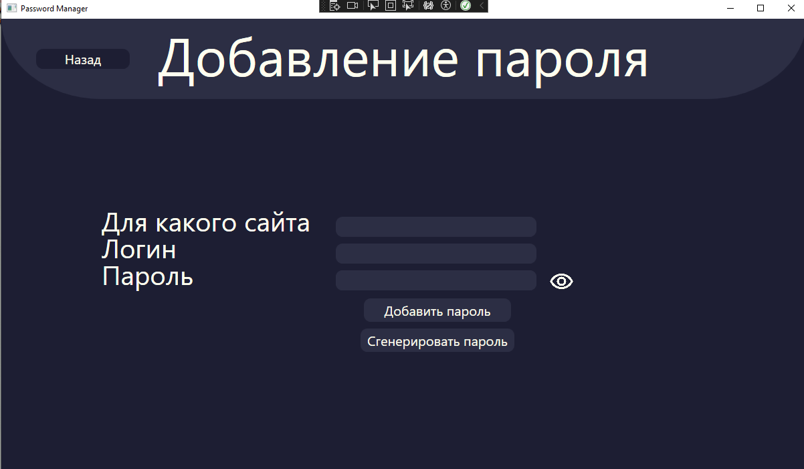

# Desktop CLient
___
Клиент сделан на WPF с применением паттерна MVVM для взаимодействия с API
___
##### Core - Ядро для MVVM
##### Models - Сущности для JSON
##### Services - Бизнес логика
##### ViewModel - Посредник между вьюхами и сервисами
##### View - UI
##### Behaviors - кастомное поведения для объектов на view
___
Клиент сделан асинхронно чтобы он не зависал пока идет отправка запроса на сервер и его обработка с ответом, одновременно с этим отключая кнопки UI чтобы пользователь не мог отправлять кучу одинаковых запросов думая что кнопка не сработала

Страница логина

Регистрация, в ней требуется не короткий и сложный пароль

Отображение всех паролей
-Кнопка сброса токена отвечает за его обновление на случай если он был украден

При добавлении пароля или его изменении есть возможность сгенерировать сложный 16-ти символьный пароль

