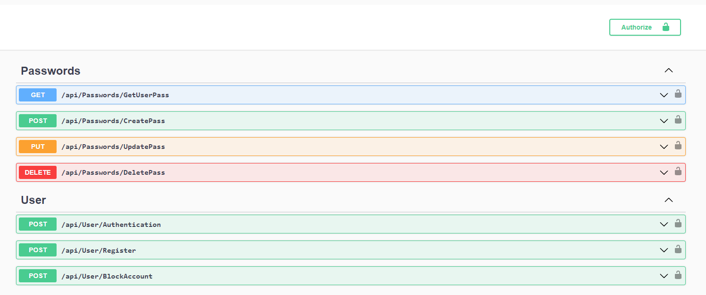
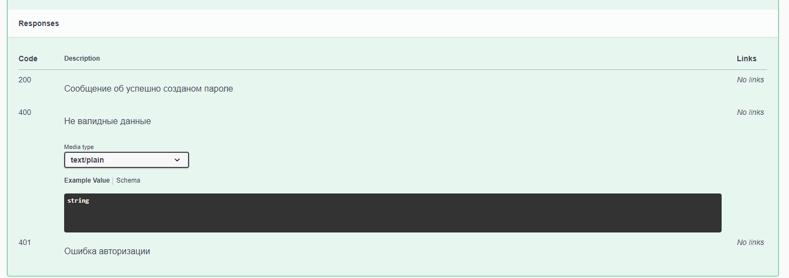

# WEB API

## Установка и запуск
```CMD
git clone https://github.com/AxVol/Password_Manager_with_WebAPI.git
cd {путь до папки с клонированным репозиторием}/WebApi
docker-compose up --build
```
Если в системе отсутствует докер, придется поднять MS SQL Server своими ручками и изменить в appsettings.json строку отвечающую за подключение к БД
___
Апи сделана на ASP.NET CORE 7 по все правилам с попытками приследовать чистую архитектуру
#### В проекте для наглядности и удобства отладки функционала подключен Swagger 
___
##### Domain - Сущности
##### DAL - доступ к базе данных
##### Services - Бизнес логика
##### Tests - Юнит тесты для сервисов
##### WebApi - Контроллеры
___
Поток данных происходит таким образом:   
Приходит JSON на контроллер -> Контроллер его обрабатывает и проверяет JWT токен, шифрует и добавляет в базу данных пароль/юзера если это не get/delete запрос -> Формирует ответ в JSON и возвращает его пользователю, в случае ошибки посылает соответствующий статус код с описанием ошибки   

При большом количестве ошибок при попытке входа, пользователь блокируется на 30 минут

api/User - Авторизирует/Создает пользователя возвращая его JWT-токен для данной сессии общения с API   
api/Passwords - Вовращает JSON вместе с сериализированым туда паролем   

Пути которые принимает API, их названия передают суть их действия

Пример запроса к конкретному эндпойту

Возможные варианты ответа от конкретного эндпойта

Модели которые принимает тот или иной метод контроллера

